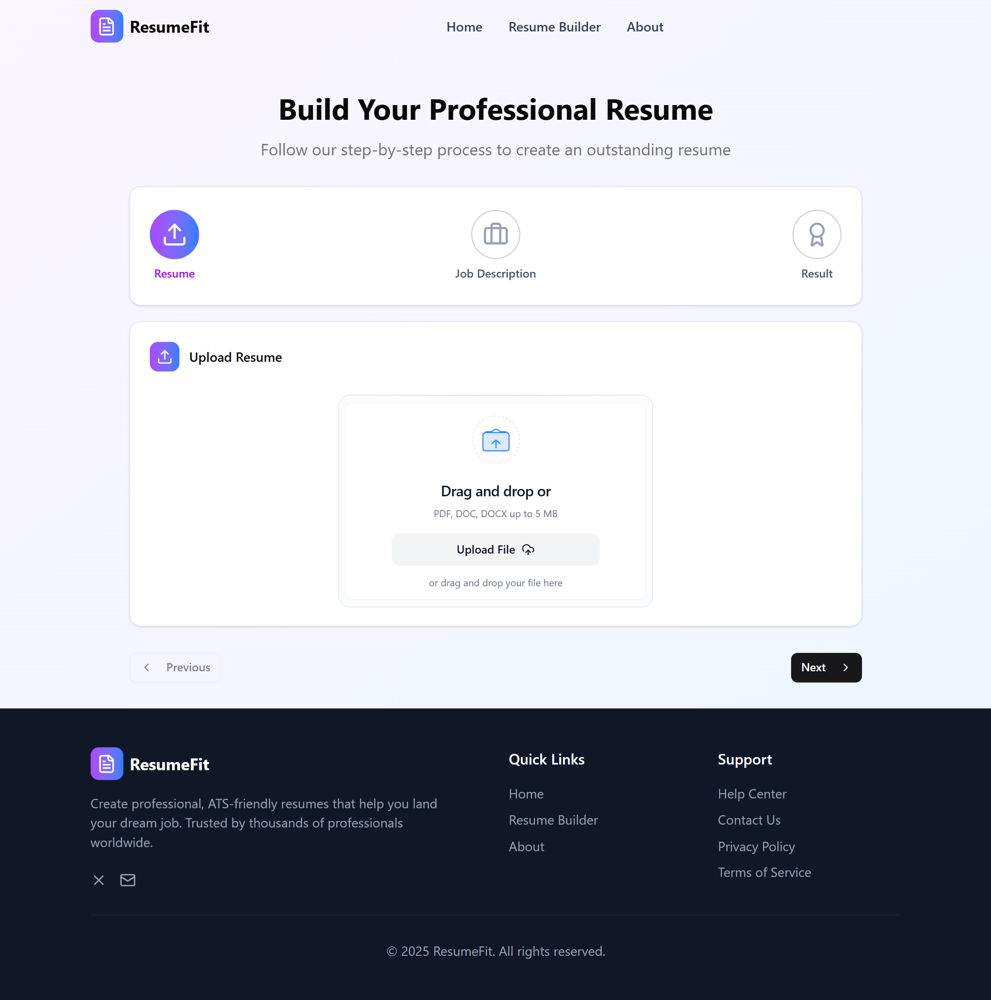
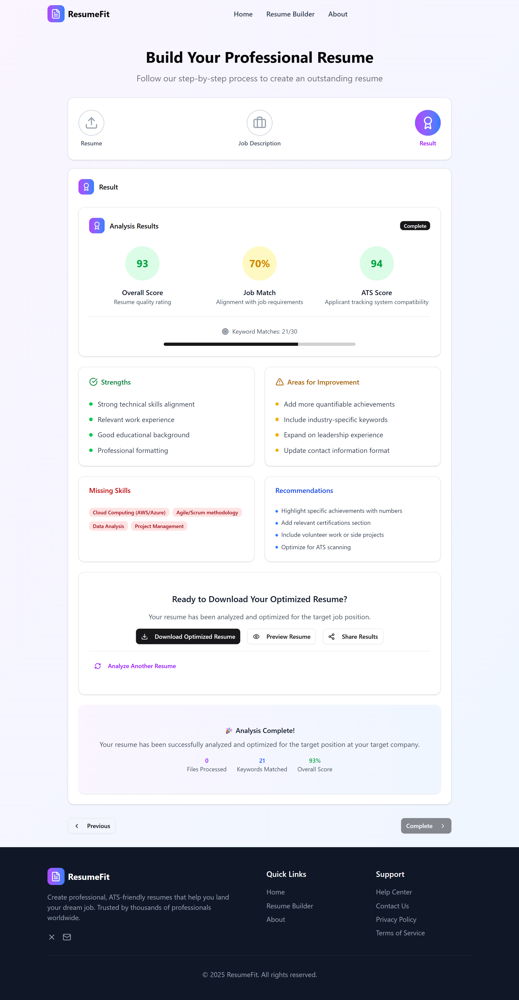

# 🧠 ResumeFit

**ResumeFit** is an AI-powered resume rewriting tool that tailors your resume based on a specific job description using Google Gemini Pro. It helps job seekers optimize their resumes for applicant tracking systems (ATS) and improve their chances of landing interviews.

---

## 🚀 Features

- ✅ Upload resume (PDF/DOCX)
- ✅ Paste job description
- ✅ Rewrites resume using Gemini AI
- ✅ Generates ATS-friendly resume PDF
- ✅ Clean UI built with Next.js
- ✅ Automated workflow powered by n8n

---

## 🛠️ Tech Stack

| Layer | Tech |
|-------|------|
| 💻 Frontend | Next.js 14 / 15 (App Router), Tailwind CSS, Shadcn UI |
| ⚙️ Backend | n8n (Self-hosted or Cloud) |
| 🧠 AI Model | Google Gemini Pro (via AI Studio API) |
| 📄 File Parsing | `pdf-parse` (Node.js) |
| 📤 PDF Generation | `html-pdf-node` or Puppeteer |
| ☁️ Deployment | Vercel (Frontend), n8n Cloud |

---
## 📸 Screenshots

### 🔹 Upload Interface

### 🔹 Tailored Resume Output (PDF Preview)

---

## 🧩 How It Works

1. User uploads their resume and a job description
2. ResumeFit extracts the resume text
3. Sends resume + job description to Gemini via n8n
4. Gemini rewrites the resume to match the job
5. The result is converted to a clean PDF
6. User can download the final tailored resume

---

## 🔧 Setup Instructions

### 1. Clone the Repo

git clone https://github.com/aliatherayyubi/ResumeFit.git
cd ResumeFit

### 2. Install Dependencies

npm install